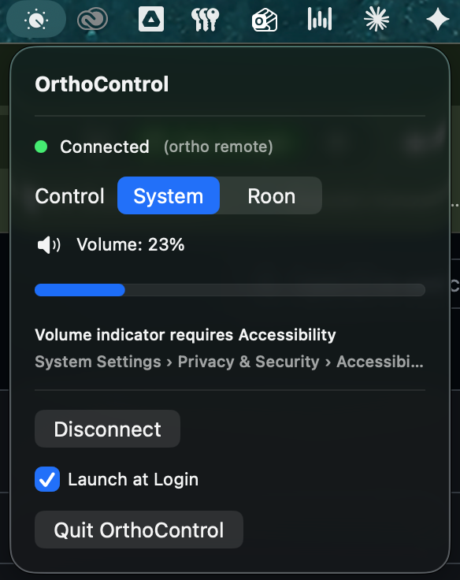
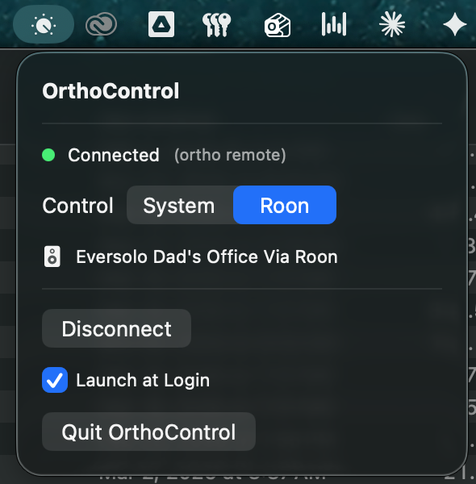

# OrthoControl for Roon

A macOS menu bar app that turns a [Teenage Engineering ORTHO Remote](https://teenage.engineering/products/ortho-remote) into a wireless volume knob — for both **system volume** and **Roon** playback.

  

 &nbsp; 

## What it does

- **Turn the knob** to change volume (1/64 step precision, same as Option+Shift+Volume)
- **Press the button** to play/pause
- **System mode** controls macOS system volume with native volume HUD
- **Roon mode** controls a Roon zone via the included Node.js extension
- Auto-connects via Bluetooth, auto-reconnects on wake from sleep
- Runs as a lightweight menu bar app (no Dock icon)

## How it works

The ORTHO Remote is a Bluetooth Low Energy (BLE) MIDI device. OrthoControl:

1. Discovers the ORTHO Remote via CoreBluetooth
2. Activates macOS's built-in BLE-MIDI driver (`MIDIBluetoothDriverActivateAllConnections`)
3. Receives MIDI CC (knob) and Note On/Off (button) events via CoreMIDI
4. Routes events to either macOS audio (CoreAudio) or Roon (via HTTP to the Node.js extension)

No pairing in Audio MIDI Setup required. No MIDI token needed.

### Where does the Roon extension run?

The Roon extension runs on the **same Mac as OrthoControl** — it does **not** need to run on your Roon Core machine. It discovers Roon Core automatically over the local network via multicast (SOOD protocol) and bridges between OrthoControl (local HTTP) and Roon Core (remote WebSocket).

**Example:** Your Roon Server runs on a Mac mini in a closet, and you want to control it with an ORTHO Remote at your desk. You install OrthoControl and the Roon extension on your MacBook Pro — the Mac you sit at. The extension finds the Mac mini's Roon Core over your home network automatically. The ORTHO Remote connects via Bluetooth to your MacBook, and OrthoControl routes knob turns and button presses to Roon on the Mac mini. Nothing needs to be installed on the Mac mini.

```
┌───────── MacBook Pro (your desk) ──────────┐         ┌─── Mac mini (closet) ───┐
│                                             │         │                         │
│  ORTHO Remote ──BLE──▶ OrthoControl.app     │         │    Roon Server          │
│                            │                │         │         ▲               │
│                          HTTP               │         │         │               │
│                            ▼                │         │         │               │
│                     roon-extension ─── ── ──│── WS ──▶│─ ── ── ─┘               │
│                    (Node.js :9330)           │  (LAN)  │                         │
└─────────────────────────────────────────────┘         └─────────────────────────┘
```

## Requirements

- macOS 14 (Sonoma) or later
- A [Teenage Engineering ORTHO Remote](https://teenage.engineering/products/ortho-remote)
- For Roon mode: [Roon](https://roon.app) with a networked audio zone, and Node.js 18+

## Installation

### Build the macOS app

```bash
cd app
swift build -c release
bash build.sh
cp -r OrthoControl.app /Applications/
```

### Set up the Roon extension (optional)

```bash
cd roon-extension
cp config.example.json config.json
# Edit config.json — set your Roon zone name
npm install
npm start
```

On first run, go to **Roon Settings > Extensions** and authorize "Ortho Remote."

## Configuration

### Roon extension (`roon-extension/config.json`)

```json
{
  "zone_name": "Your Zone Name",
  "volume_step": 2,
  "http_port": 9330
}
```

| Key | Description |
|-----|-------------|
| `zone_name` | Exact display name of your Roon zone (check Roon Settings > Audio) |
| `volume_step` | dB change per knob tick (default: 2) |
| `http_port` | Local HTTP port for OrthoControl communication (default: 9330) |

### Accessibility (optional)

For the native macOS volume HUD to appear when using System mode, grant OrthoControl accessibility access:

**System Settings > Privacy & Security > Accessibility > OrthoControl**

Without this, volume still changes — you just won't see the on-screen indicator.

## Architecture

```
OrthoControl.app (Swift/SwiftUI)
├── Bluetooth/       # BLE discovery + MIDI driver activation
├── MIDI/            # CoreMIDI event parsing
├── Audio/           # CoreAudio volume + media key simulation
├── Roon/            # HTTP client for the Roon extension
├── Models/          # App state, connection status, control mode
├── Views/           # Menu bar UI
└── App/             # App entry point + coordinator

roon-extension/ (Node.js)
├── index.js         # Roon API + HTTP server
├── config.json      # Zone config (user-specific, gitignored)
└── scripts/         # postinstall patch for Node.js 22+
```

## Troubleshooting

| Issue | Fix |
|-------|-----|
| ORTHO Remote not found | Turn it on (press button), wait ~5 seconds, check Bluetooth is on |
| Knob works but no volume HUD | Grant Accessibility permission (see above) |
| "Roon extension not running" | Start it: `cd roon-extension && npm start` |
| Roon zone not found | Check `zone_name` in config.json matches Roon exactly |
| Volume too sensitive / too slow | Adjust `volume_step` in config.json (1 = fine, 5 = coarse) |

## License

MIT
